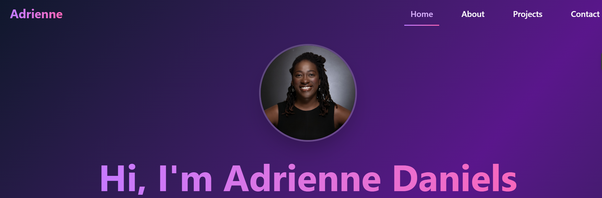

# 💻 Adrienne Daniels — Portfolio



## Table of Contents

- [About](#about)
- [Tech Stack](#tech-stack)
- [Getting Started](#getting-started)
- [Code Example](#code-example)
- [Features](#features)
- [Recent Improvements](#recent-improvements)
- [Project Status](#project-status)
- [Why This Project?](#why-this-project)
- [Contact](#contact)
- [License](#license)

---

## 📌 About

This is my personal portfolio site — built with **Vite + React**, **TypeScript**, **Tailwind CSS**, and **Framer Motion** — designed to highlight my skills, showcase projects, and provide an easy way to get in touch. It emphasizes strong UI/UX design, accessible layout, and responsive animation for a clean, engaging experience on any device.

---

## 🛠 Tech Stack

**Frontend**

- Vite + React  
- TypeScript  
- Tailwind CSS  
- React Router  
- Framer Motion  
- React Icons   
- Google Fonts  

**Hosting**

- Netlify

---

## 🚀 Getting Started

### Prerequisites

- Node.js  
- npm or yarn

### Usage
Try it here: [Live Demo](https://reciperainbow.netlify.app/)

### Cloning the Repository (Optional)
```bash
git clone https://github.com/Adrienner1988/portfolio.git
cd portfolio
npm install
npm run dev

## Code Examples
```javascript
<motion.div
  initial={{ opacity: 0, y: 40 }}
  animate={{ opacity: 1, y: 0 }}
  transition={{ duration: 0.6 }}
>
  <h1 className="text-4xl font-bold">Hi, I'm Adrienne 👋</h1>
</motion.div>


```

## ✨ Features
-Responsive design across all screen sizes
-Animated page transitions & modals
-Project section with hover effects, tag filters, and modal details
-“About Me” modal with image viewer
-Smooth scrolling and lazy route loading
-Reusable button + card components with Tailwind
-Contact section with external links and styled email form


## 📈 Status
Fully functional, mobile-optimized, and deployed. Ongoing polish and animation upgrades will continue. 

## Why
This portfolio represents my growth as a developer, from learning design systems and animations to integrating CMS and full-stack thinking. It’s a playground for building reusable components, trying modern tooling, and turning ideas into interfaces that feel alive.


## Contact
- Email: `adriennerdaniels@gmail.com`
- LinkedIn: `https://www.linkedin.com/in/adriennerdaniels/`
- GitHub: `Adrienner1988`

## License
This project is currently not licensed.
